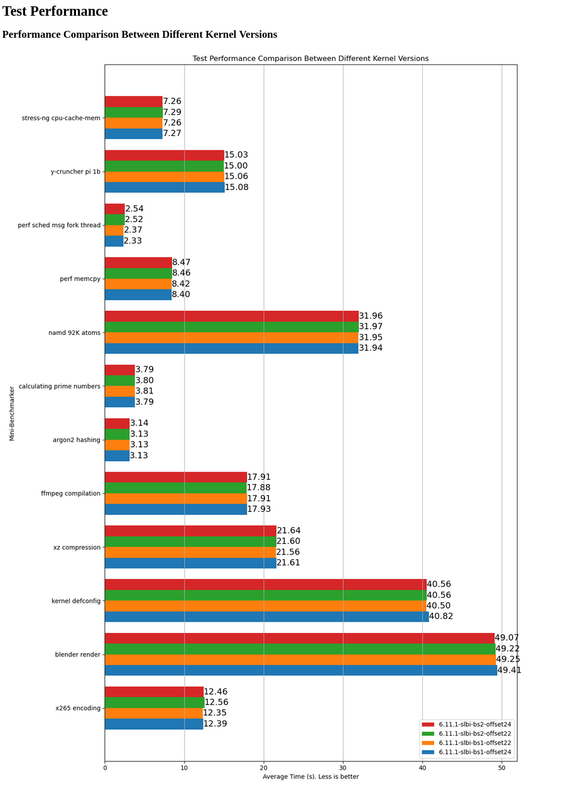
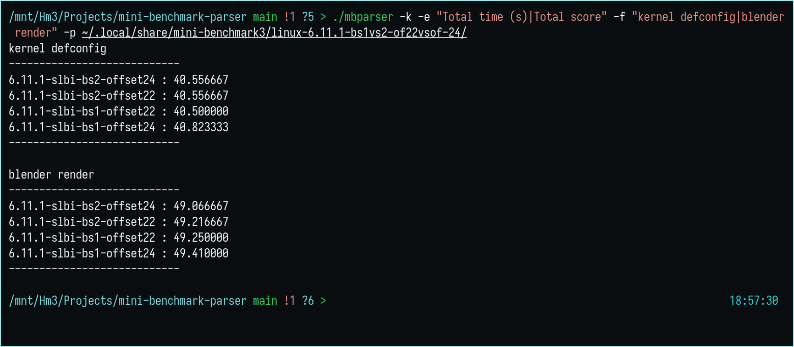

# mini-benchmark-parser

mini-benchmark-parser is a C-based log parser and visualizer for Mini Benchmarker log files, leveraging embedded Python for chart generation. It provides advanced filtering, aggregation, and comparison capabilities, and can output both textual summaries and HTML-embedded charts.

[mini-benchmarker](https://gitlab.com/torvic9/mini-benchmarker) by Tor Vic

## Features

- **Log Path Configuration**: Specify a directory of Mini Benchmarker log files.
- **Test/Kernal Filtering**: Include or exclude specific tests and kernel versions using patterns.
- **Benchmark Display**: Print benchmark results to stdout.
- **Combine & Average**: Merge duplicate kernel entries and calculate average results.
- **Kernel Comparison**: Compare performance across multiple kernel versions in a tabular format.
- **Chart Generation**: Create bar charts of kernel comparisons via embedded Python (`matplotlib`).
- **HTML Report**: Generate an HTML page embedding the comparison charts.
- **System Info**: Display basic system information alongside benchmarks.
- **Output Files**:  
  - All generated PNG charts and the HTML report are saved under  
    `~/.local/share/mbparser/`  
  - Non existing directory will be created if missing.  
- **Legacy Log Support**:  
  - Also capable of parsing older “mini” and “nano” modes from the original Mini Benchmarker logs.

## Dependencies

- **Build Tools**: GCC (or compatible C compiler), `make`
- **Python**: Python 3.x interpreter and development headers (`python3` and `python3-devel` / `python3-dev` packages)
- **Python Modules**:
  - `numpy`
  - `matplotlib`

> **Note**: The embedded Python code uses `python3-config` to discover include and linker flags, so ensure the development package for your Python version is installed.

## Installation

```bash
# Clone the repository
git clone https://github.com/julmajustus/mini-benchmark-parser.git
cd mini-benchmark-parser

# Install system dependencies (example for Debian/Ubuntu)
sudo apt-get install build-essential python3-dev python3-pip pkg-config
pip3 install --user numpy matplotlib

# Build mbparser
make

# (Optional) Install to /usr/local/bin
sudo make install

# Uninstall
sudo make uninstall
```

## Usage

```shell
mbparser [OPTIONS]
```

### Options

| Short | Long                | Argument    | Description                                             |
|:-----:|:--------------------|:------------|:--------------------------------------------------------|
| `-h`  | `--help`            |             | Show this help message and exit                         |
| `-p`  | `--log-path`        | `<dir>`     | Directory containing log files (default: `.`)            |
| `-f`  | `--include-test`    | `<pattern>` | Include only tests matching the regex pattern           |
| `-F`  | `--include-kernel`  | `<pattern>` | Include only kernel versions matching the regex pattern |
| `-e`  | `--exclude-test`    | `<pattern>` | Exclude tests matching the regex pattern                |
| `-E`  | `--exclude-kernel`  | `<pattern>` | Exclude kernel versions matching the regex pattern      |
| `-b`  | `--bench`           |             | Print all matching benchmark results                    |
| `-c`  | `--combine`         |             | Combine duplicate kernel data and calculate averages    |
| `-k`  | `--compare-kernels` |             | Print kernel performance comparisons                    |
| `-g`  | `--generate-chart`  |             | Generate kernel comparison charts                       |
| `-G`  | `--make-html`       |             | Generate an HTML page for the charts                    |
| `-i`  | `--info`            |             | Display system information                              |

### Examples

```bash
# Print benchmarks for Test1 and Test2 on two specific kernels\
mbparser --log-path ~/.local/share/mini-benchmark3/ --include-test "kernel defconfig|blender render" --include-kernel "6.13.0-gentoo-dist|6.14.0-gentoo-dist" 
--bench

# Combine, show system info, using logs in ~/.local/share/minibenchmark
mbparser --combine --info --log-path ~/.local/share/minibenchmark

# Generate HTML charts, excluding summary entries
mbparser -p ~/.local/share/mini-benchmark3/linux-6.11.1-bs1vs2-of22vsof-24 -gG -e "Total time \(s\)|Total score"

mbparser -k -e "Total time (s)|Total score" -f "kernel defconfig|blender render" -p ~/.local/share/mini-benchmark3/linux-6.11.1-bs1vs2-of22vsof-24
```




